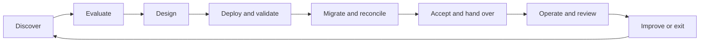

# Documentation Systems Blueprint

**A vendor-neutral blueprint for planning, evaluating, delivering and handing over documentation platforms.** Docmost is one reference implementation, not the architecture's required product.

A documentation platform succeeds when people can find trustworthy information, maintain it and recover it after an incident. This repository joins technical delivery with content migration, ownership and operational acceptance.

**Status:** initial reference implementation; configuration and repository checks are automated. Production deployment, migration fidelity, access-control acceptance and timed disaster recovery remain project-specific validation gates. No customer deployment or business outcome is claimed here. See the [validation record](handover/validation-record.md).

## Start here

- **Employer or customer:** read the [architecture](architecture/overview.md), [decision matrix](evaluation/decision-matrix.md), [migration plan](migration/legacy-to-new-platform.md) and [acceptance checklist](handover/acceptance-checklist.md).
- **Implementer:** capture [requirements](evaluation/requirements.md), select a product using evidence, then follow the [deployment guide](deployment/README.md).
- **Operator:** start with [backup](operations/backup.md), [restore](operations/restore.md) and [monitoring](operations/monitoring.md).
- **Content owner:** use the [documentation lifecycle](governance/documentation-lifecycle.md), [templates](templates/README.md), the [Docmost space structure](governance/docmost-structure.md) and [reference cases](examples/reference-cases.md).

## Delivery lifecycle



| Phase | Deliverable | Exit criterion |
| --- | --- | --- |
| Discover | Requirements, inventory, stakeholders, classification | Sponsor accepts scope and recovery targets |
| Evaluate | Weighted matrix, proof of concept, edition and cost review | Mandatory requirements pass; decision recorded |
| Design | Architecture, access model, ADRs, threat review | Operators and content owners approve design |
| Deploy | Reproducible configuration, release manifest | Login, editing, uploads, mail and TLS verified |
| Migrate | Mapping, exception register, reconciliation | All critical content and permissions accepted |
| Hand over | Training, recovery exercise, acceptance evidence | A second administrator operates independently |
| Operate | Reviews, updates, alerts, restore exercises | Measured service objectives and maintained content |
| Exit | Portable exports, retention and deletion record | Data and responsibilities transferred securely |

## Repository map

| Directory | Purpose |
| --- | --- |
| [architecture/](architecture/overview.md) | Boundaries, diagrams and architecture decisions |
| [evaluation/](evaluation/requirements.md) | Requirements, scoring method and implementation selection |
| [deployment/](deployment/README.md) | Docker Compose, environment example and TLS reverse proxy |
| [migration/](migration/legacy-to-new-platform.md) | Product-independent migration and BookStack → Docmost example |
| [operations/](operations/backup.md) | Backup, recovery, updates, monitoring and incidents |
| [security/](security/access-model.md) | Access, RBAC, secrets and hardening |
| [governance/](governance/ownership.md) | Accountability, publishing and review rules |
| [templates/](templates/README.md) | Two core authoring templates, specialist templates and a system overview table |
| [handover/](handover/acceptance-checklist.md) | Acceptance, administration, onboarding and evidence |
| [examples/fictional-system/](examples/fictional-system/README.md) | Worked fictional service and migration records |

## Reference implementation

The single-host example uses Docmost, PostgreSQL, Redis and Caddy. It illustrates persistence, network boundaries, controlled updates and recoverability. It is not high availability. A host outage interrupts service; the accepted recovery objective determines whether this design is suitable.

The quick start binds only to loopback. The optional proxy configuration is a separate deployment mode. Real names, credentials, inventories and customer evidence belong in private deployment repositories, never here.

```sh
cd deployment
cp .env.example .env
# Fill the two empty secrets using independent outputs of: openssl rand -hex 32
chmod 600 .env
docker compose config --quiet
docker compose up -d
```

Continue with the [full setup and acceptance steps](deployment/README.md). Default component versions are reference choices, not a promise that future patch releases are compatible. Production requires approved immutable image digests and a completed recovery test.

## Docmost operating model

Use `00 Documentation`, `10 Infrastructure`, `20 Systeme & Dienste`, `30 Workflow & Abläufe` and `99 Archive`. The [content model](governance/docmost-structure.md) defines placement, subpages and navigation. Keep `00 - Systemübersicht` as an ordinary [Markdown table](templates/system-overview.md): this baseline is Community-edition-first and does not require paid Bases.

GitHub holds implementation; Docmost holds operations and knowledge transfer. Update documentation for operationally relevant changes, including material UI workflows, without mirroring every cosmetic change or refactor. See the [change rules](governance/change-boundary.md), [sanitized reference cases](examples/reference-cases.md) and [future roadmap](roadmap.md). A standalone local-LLM documentation interview tool is a later idea, not an implemented feature.


## What this demonstrates

Requirements engineering, defensible product selection, architectural tradeoffs, container delivery, migration reconciliation, least privilege, recovery planning, content governance and operational handover. The [portfolio guide](handover/portfolio-guide.md) explains how to distinguish delivered artifacts from subsequently measured project results.

Examples use synthetic values, reserved example domains, loopback addresses and container DNS aliases. Docmost, Signaturee and Bistro Connect are named reference cases described only through generic architecture and documentation lessons. No employer identity, private operational inventory, real credentials or customer outcomes are included.

## Validation and reuse

Run `python3 scripts/check_repository.py` and the configuration checks described in [CONTRIBUTING.md](CONTRIBUTING.md). GitHub Actions repeats those checks. Passing them proves structural/configuration validity, not operational readiness.

Licensed under [MIT](LICENSE). Third-party software retains its own license and edition terms. See [source references](architecture/sources.md), checked 2026-09-30.
