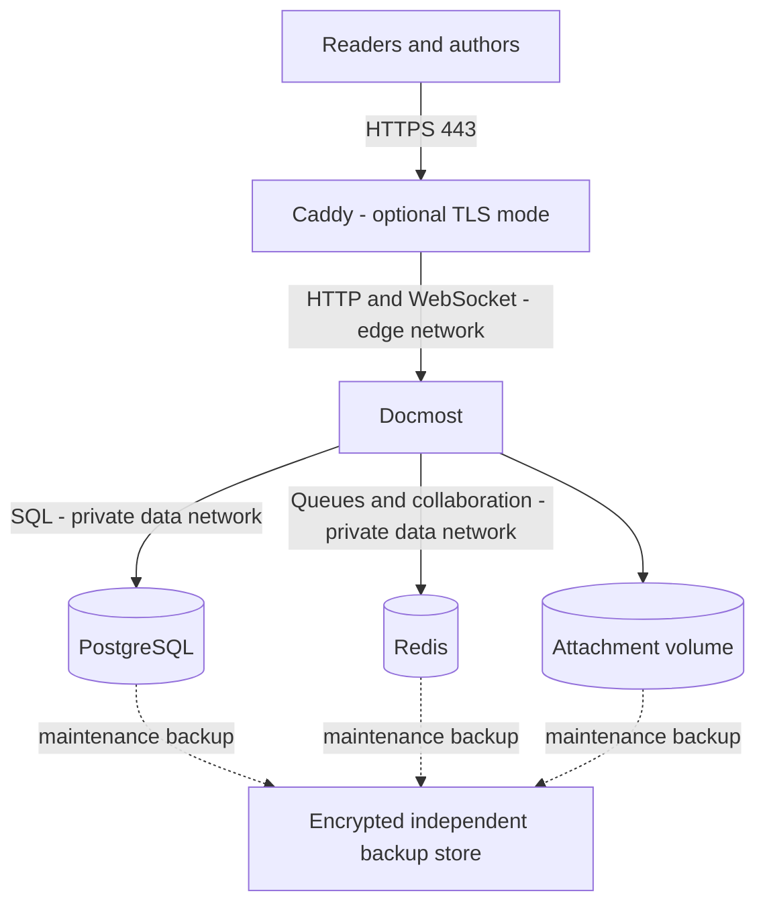

# Architecture overview

## Product-independent design

Separate five responsibilities: authoring and retrieval; identity and authorization; durable content storage; operations and recovery; governance and lifecycle. Define interfaces and exit paths before choosing software. Markdown/HTML exports are useful for portability but do not replace application-aware backups.

The scope is internal operational knowledge, runbooks and project handovers. Password storage, a legal records archive and a service desk are separate systems; link to approved records rather than duplicating them.

## Reference topology

Caddy alone publishes external ports in TLS mode. The base lab publishes Docmost only on loopback. Database and Redis never publish host ports. Docker networks reduce accidental exposure; they are not a substitute for host security. Application egress remains possible through the edge network for approved mail and integrations.

Data persisted: database, uploaded files, Redis state and proxy state. Secrets/configuration are escrowed separately. The platform operator controls hosts and backups and therefore has effective access to content even if application roles are narrower.

## Limits and scaling triggers

This design accepts scheduled downtime and a single failure domain. Establish capacity from a representative pilot: concurrent editors, page and attachment volume, search latency, backup duration and growth. Add monitored storage headroom first. If recovery or uptime objectives cannot be met, evaluate managed storage/database, redundancy and the application's supported multi-instance architecture as a new ADR; do not merely add replicas.

Every customer adaptation must specify residency, retention, authentication, edition/license, mail, network ingress/egress, ownership and recovery objectives. Start with [requirements](../evaluation/requirements.md).

## Content architecture

The [Docmost content model](../governance/docmost-structure.md) maps the five reference spaces, while the [implementation/operations boundary](../governance/change-boundary.md) prevents duplicate sources of truth. The baseline uses ordinary pages and tables and requires no paid features. A possible standalone local documentation intake assistant remains [future roadmap](../roadmap.md), outside the deployed architecture.
